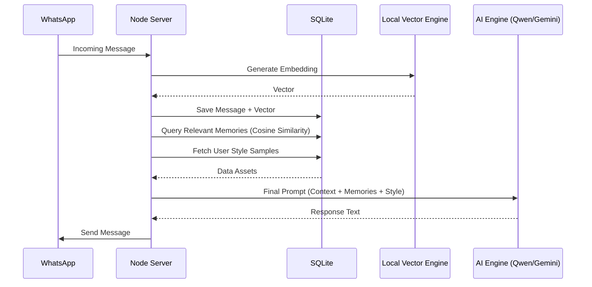

# System Architecture: RAG & Memory Engine

This document provides a deep-dive into how the **WhatsApp Crawler** handles message processing, long-term memory retrieval (RAG), and context construction for the AI.

---

## 1. High-Level Flow
When a message arrives at the server, it follows a standard pipeline before the AI even sees it:
1. **Ingestion**: Baileys `messages.upsert` event triggers.
2. **Storage**: Message is cleaned, stripped of group/broadcast metadata, and saved to SQLite.
3. **Vectorization**: If the message is a personal text, a 384-dimensional vector is generated locally.
4. **Retrieval**: The orchestrator searches the DB for the most relevant past conversations.
5. **Orchestration**: A dynamic prompt is built and sent to the selected engine (Gemini, Chaka, or Local Qwen).

---

## 2. Ingestion & Storage (`saveMessageToDB`)
Every personal message is saved to a SQLite table. This ensures the RAG engine has a complete source of truth.

### Key Logic:
- **Vision Integration**: If an image is sent, the system uses a Vision model to describe the scene first, then indexes that description as text context.
- **Duplicate Prevention**: Baileys often sends the same message twice (History Sync vs. Live Notification). The system uses message ID and timestamps to prevent duplicate AI responses.

```javascript
// server.js:L601
await db.run(`
    INSERT OR REPLACE INTO messages (message_id, session_id, contact_id, text, sender, timestamp, date, is_from_me, embedding)
    VALUES (?, ?, ?, ?, ?, ?, ?, ?, ?)
`, [msgId, sessionId, cleanId, dbText, sender, safeTs, ISOString, isFromMe, vector]);
```

---

## 3. The Memory Engine (Local RAG)
Instead of using expensive cloud embeddings, the system uses a **100% Local Vector Engine**.

- **Model**: `Xenova/all-MiniLM-L6-v2` (Running via Transformers.js).
- **Format**: 384-dimensional floating point vectors.
- **Search Method**: Cosine Similarity.

### Vector Generation:
```javascript
// server.js:L178
async function generateLocalEmbedding(text) {
    const output = await localEmbedder(text, { pooling: 'mean', normalize: true });
    return Buffer.from(new Float32Array(output.data).buffer);
}
```

### Retrieval Logic:
The retrieval doesn't just pull random messages; it pulls **Context Windows**. If a relevant message is found from 3 months ago, the system pulls the 2 messages before and after it to provide "situational awareness."

---

## 4. Context Window & Token Management
The AI does not have "unlimited" memory; it is bounded by a **Dynamic Token Budget** to ensure fast responses and cost-efficiency.

### Adaptive Limits:
The system calculates a "Token Per Minute" (TPM) budget. Based on current usage, it shrinks or expands the AI's "brain" size:

| Available Tokens | Recent Context | Recalled Memories |
| :--- | :--- | :--- |
| > 20,000 | 15 Messages | 3 Memories |
| > 10,000 | 8 Messages | 1 Memory |
| < 10,000 | 3 Messages | 0 Memories |

---

## 5. Style & Personality Injection
The system uses a unique **Style Sampler** to make the AI sound like you.

- **Process**: It queries the DB for your last 15 messages to that specific contact.
- **Effect**: It extracts your slang, punctuation (or lack thereof), and emoji usage, then feeds it to the AI as a `[STYLE REFERENCE]`.

---

## 6. Interaction Pipeline Summary



---

## 7. Future Optimizations (Team Roadmap)
To make this better with your team, consider:
1. **Vector DB Migration**: Currently, it uses a linear scan in SQLite. For sessions with >50k messages, migrating to a specialized vector extension (like `sqlite-vss`) would be faster.
2. **Hybrid Search**: Combine BM25 (keyword search) with Vector search for better retrieval of specific names or dates.
3. **Cross-Session RAG**: Allowing Node A to "learn" from Node B's conversations if they share the same Global Persona.
